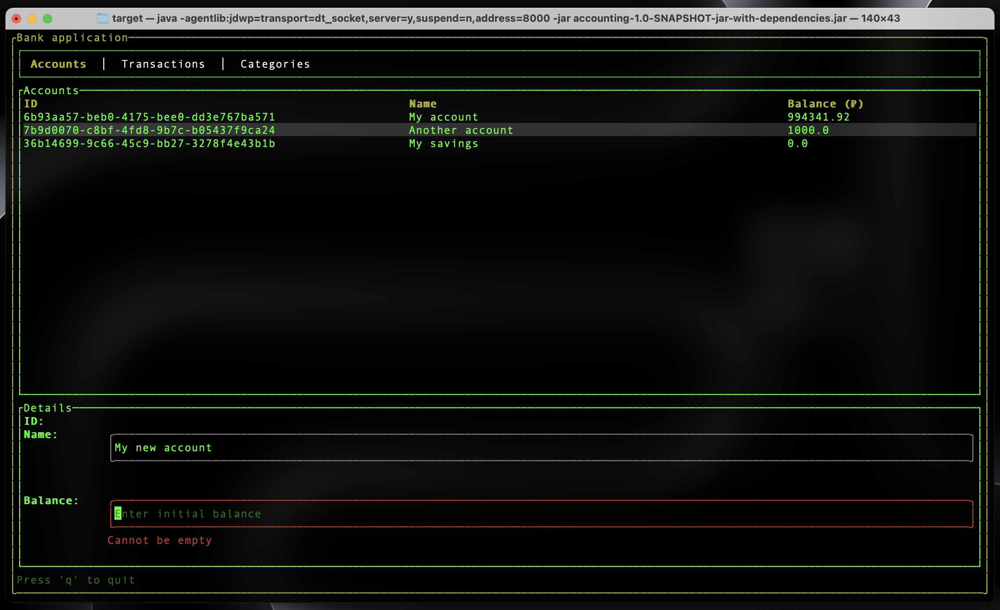
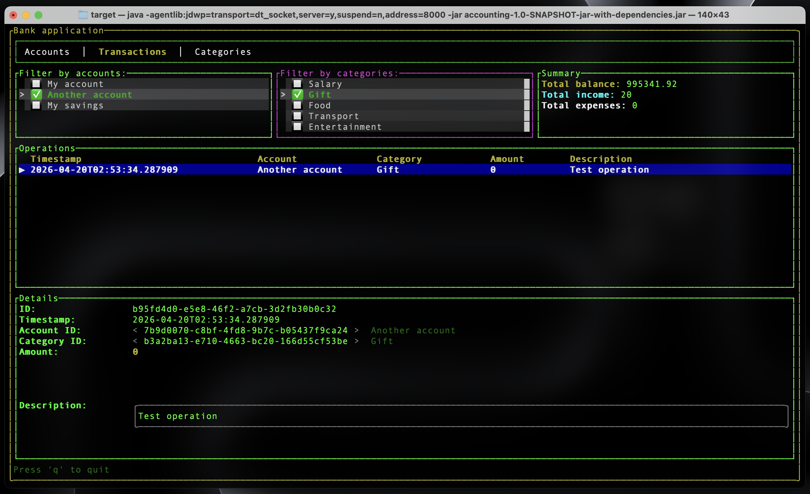
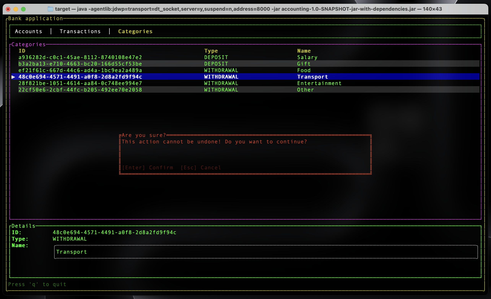

# Модуль `accounting`

Данный модуль реализует консольное (TUI) приложение
для учёта финансов с хранением состояния в памяти и возможностью
сериализации в файлы различных форматов.

## Как запустить в режиме отладки?

```
mvn install

mvn package -f "./accounting/pom.xml"

java -agentlib:jdwp=transport=dt_socket,server=y,suspend=n,address=8000 -jar ./accounting/target/accounting-1.0-SNAPSHOT-jar-with-dependencies.jar
```

## Скриншоты







Демонстрация работы приложения: [`screenshots/demo.mp4`](screenshots/demo.mp4).

## 1. Предметная область

Основные сущности предметной области:

- `BankAccount` — банковский счёт (ID, имя, текущий баланс);
- `Category` — категория операции, принадлежащая типу `DEPOSIT` / `WITHDRAWAL` / `UNKNOWN`;
- `Operation` — финансовая операция (зачисление либо списание) с привязкой к счёту и категории, суммой, датой и описанием.

Пользователь может:

- вести реестр счетов и категорий;
- регистрировать приходные/расходные операции, которые автоматически изменяют баланс счёта (`AccountsService.applyOperation`);
- просматривать операции с фильтрацией по выбранным счетам и категориям;
- видеть сводку: общий баланс, суммарные доходы и расходы (`AnalyticsService`);
- экспортировать/импортировать состояние в/из CSV, JSON, YAML.

UI реализован как терминальное приложение на базе фреймворка `tamboui`
(`AccountingTUI` расширяет `ToolkitApp`).

## 2. Единый code style

В модуле выдержан общий стиль (package-by-feature: `models`, `services`,
`components`, `repositories`, `io/{accounts,categories,operations,app,common,shared}`):

- повсеместно используется Lombok (`@Getter`, `@Setter`, `@RequiredArgsConstructor`, `@AllArgsConstructor`, `@NonNull`, `@SneakyThrows`);
- Spring-аннотации применяются консистентно: `@Component`, `@Service`, `@Controller`, `@Repository`, `@Configuration`;
- в контроллерах методы разделяются комментариями `// Queries` / `// Commands`;
- используется 4 пробела для отступов, UTF-8, импорты не содержат wildcard'ов;
- имена файлов и классов выдержаны в PascalCase, методы — в camelCase, константы — в UPPER_SNAKE_CASE.

## 3. Использованные паттерны

### 3.1 Паттерн «Фабричный метод»

Частично применен в иерархии таблиц TUI.

```24:43:accounting/src/main/java/com/bmstu_bureau_1440/accounting/io/common/widgets/AbstractTableWidget.java
public abstract class AbstractTableWidget<T, K> extends StyledElement<AbstractTableWidget<T, K>> {

    protected final K controller;

    protected List<Column<T>> columns;

    protected TableState tableState;

    public AbstractTableWidget(K controller) {
        this.controller = controller;
        this.columns = getColumns();
        this.tableState = getStateProvider().apply(controller);
    }

    protected abstract Function<K, TableState> getStateProvider();

    protected abstract List<Column<T>> getColumns();

    protected abstract Function<K, List<T>> getDataProvider();
```

Абстрактные методы `getColumns()`, `getStateProvider()`, `getDataProvider()` играют роль
фабричных методов: конкретные наследники (`OperationsTableWidget`, `AccountsTableWidget`,
`CategoriesTableWidget`) «создают» коллекцию колонок и провайдеры, а родитель использует
продукт для построения виджета `Table`.

### 3.2 Паттерн «Фасад»

Применён в нескольких местах:

- `FileStorageRepository` — фасад над всеми реализациями `StorageSerializer`. Клиент работает
  с простыми методами `exportToFile(FileType)` / `importFromFile(FileType)` и не знает про
  выбор конкретного сериализатора, работу с `Path`, Jackson/OpenCSV и аспекты валидации путей:

  ```24:47:accounting/src/main/java/com/bmstu_bureau_1440/accounting/repositories/FileStorageRepository.java
  public FileStorageRepository(List<StorageSerializer> serializers, Storage storage) {
      this.serializers = serializers.stream()
              .collect(Collectors.toMap(StorageSerializer::getFileType, Function.identity()));
      this.storage = storage;
  }

  public void exportToFile(FileType fileType) {
      try {
          StorageSerializer serializer = serializers.get(fileType);
          serializer.serialize(storage, exportPath);
      } catch (Exception e) {
          throw new RuntimeException(e);
      }
  }
  ```

- `AnalyticsService.getAnalytics()` — фасад над `Storage` и `CategoriesService`: одной точкой
  скрывает обход операций и разбиение сумм по типам, возвращая готовый `AnalyticsResult`.
- `AccountingTUI` — фасад над множеством виджетов и контроллеров: компонует общее дерево рендеринга и предоставляет единую точку старта `run()`.

### 3.3 Паттерн «Команда»

Применён в двух формах:

- Явно, **команда через `Runnable`** — `ConfirmationDialogWidget` принимает `onConfirm` и `onCancel` как команды:

  ```17:22:accounting/src/main/java/com/bmstu_bureau_1440/accounting/io/common/widgets/ConfirmationDialogWidget.java
  public class ConfirmationDialogWidget extends StyledElement<ConfirmationDialogWidget> {

      private Runnable onConfirm;

      private Runnable onCancel;
  ```

  На стороне вызова (например, в `OperationsTableWidget`) передаются method references
  `controller::removeOperation`, которые играют роль конкретных команд (`ConcreteCommand`),
  а диалог — роль `Invoker`.

- Идейная реализация на уровне контроллеров: в `OperationsTuiController`,
  `AccountsTuiController`, `CategoriesTuiController` методы раздела `// Commands`
  (`createOrUpdateOperation`, `removeAccount`, `toggleAccountSelection`, …) представляют
  пользовательские команды; обработчик нажатия клавищ `handleKeyEvent` в виджетах играет роль
  Invoker'а, сопоставляя клавиши с командами.

### 3.4 Паттерн «Шаблонный метод»

Применён дважды, это один из самых выраженных паттернов модуля.

1. `AbstractTableWidget.renderContent(...)` задаёт общий скелет отрисовки таблицы —
   построение заголовка, обход данных, усечение строк, оформление строк, вызов `Table.builder()` —
   а конкретные шаги делегированы абстрактным методам `getColumns`, `getDataProvider`,
   `getStateProvider`.

2. `AbstractFilterWidget.renderContent(...)` задаёт единый алгоритм построения списка
   «чекбоксов» (`setItemsData → normalizeSelection → renderList`), оставляя наследникам
   реализовать только прикладные хуки:

   ```32:34:accounting/src/main/java/com/bmstu_bureau_1440/accounting/io/common/widgets/AbstractFilterWidget.java
   protected abstract List<ItemData> getItemsData();

   protected abstract void onItemSelected(ItemData itemData);
   ```

   Наследники — `AccountsSelectorFilterWidget`, `CategoriesSelectorFilterWidget`.

## 4. Принципы SOLID

| Принцип | Где применён | Пример |
|---|---|---|
| **S**RP – единственная ответственность | `accounting/src/main/java/com/bmstu_bureau_1440/accounting/services/AnalyticsService.java` | Класс занимается только подсчётом аналитики (общий баланс, доходы, расходы), не реализует логику обновления данных или построения пользовательского интерфейса. |
| **O**CP – открыт для расширения, закрыт для модификации | `accounting/src/main/java/com/bmstu_bureau_1440/accounting/components/StorageSerializer.java` + `FileStorageRepository` | Добавление нового формата (например, XML) реализуется добавлением нового `@Component`-сериализатора без изменения репозитория: Spring сам добавит его в `List<StorageSerializer>`. |
| **L**SP – подстановка Барбары Лисков | `accounting/src/main/java/com/bmstu_bureau_1440/accounting/io/common/widgets/AbstractTableWidget.java` | `AccountsTableWidget`, `CategoriesTableWidget`, `OperationsTableWidget` взаимозаменяемы там, где ожидается `AbstractTableWidget` (и подставляются в `AccountingTUI`). |
| **I**SP – разделение интерфейсов | `accounting/src/main/java/com/bmstu_bureau_1440/accounting/components/StorageSerializer.java` | Интерфейс сведён к трём методам, относящимся строго к сериализации; клиент не обязан знать про парсинг CSV, Jackson или аспекты. |
| **D**IP – инверсия зависимостей | `accounting/src/main/java/com/bmstu_bureau_1440/accounting/repositories/FileStorageRepository.java` | Репозиторий зависит от абстракции `StorageSerializer`, а не от `CsvStorageSerializer`/`JsonStorageSerializer`/`YamlStorageSerializer`. |

## 5. Принципы GRASP

| Принцип | Где применён | Пример |
|---|---|---|
| Information Expert | `accounting/src/main/java/com/bmstu_bureau_1440/accounting/services/AccountsService.java` | Всё, что касается состояния счёта (применение операции, изменение баланса), сосредоточено там, где есть информация о счёте. |
| Creator | `accounting/src/main/java/com/bmstu_bureau_1440/accounting/services/OperationsService.java` | `OperationsService` создаёт `Operation`, поскольку агрегирует необходимые данные (категорию, счёт, сумму) и немедленно сохраняет объект в `Storage`. |
| Controller | `accounting/src/main/java/com/bmstu_bureau_1440/accounting/io/operations/controller/OperationsTuiController.java` | Класс-контроллер принимает пользовательские события от виджетов и оркестрирует вызовы сервисов и обновление состояния. |
| Low Coupling | `accounting/src/main/java/com/bmstu_bureau_1440/accounting/repositories/FileStorageRepository.java` | Репозиторий связан с сериализаторами только через интерфейс `StorageSerializer`, а с моделью — через `Storage`. |
| High Cohesion | `accounting/src/main/java/com/bmstu_bureau_1440/accounting/services/CategoriesService.java` | Все методы касаются ровно одной темы — жизненного цикла `Category`. |
| Polymorphism | `accounting/src/main/java/com/bmstu_bureau_1440/accounting/components/JsonStorageSerializer.java` (и соседние) | Разные форматы реализованы как полиморфные реализации `StorageSerializer`, вместо `switch/if` по `FileType`. |
| Pure Fabrication | `accounting/src/main/java/com/bmstu_bureau_1440/accounting/components/CsvSerializer.java` | Не существует в предметной области, введён как технический помощник для работы с OpenCSV, чтобы разгрузить доменные классы. |
| Indirection | `accounting/src/main/java/com/bmstu_bureau_1440/accounting/utils/PathAccessCheckAspect.java` | AOP-аспект опосредует проверку доступа к путям между вызовом сериализатора и файловой системой, устраняя прямую зависимость сериализаторов от проверок. |
| Protected Variations | `accounting/src/main/java/com/bmstu_bureau_1440/accounting/components/StorageSerializer.java` | Интерфейс защищает клиентский код от изменения конкретного формата файла или используемой библиотеки сериализации. |

## 6. DI-контейнер

Используется **Spring IoC / Spring Context** (модуль `spring-context` + `spring-aop` для AOP).

Конфигурация декларативная:

```1:11:accounting/src/main/java/com/bmstu_bureau_1440/accounting/AppConfig.java
package com.bmstu_bureau_1440.accounting;

import org.springframework.context.annotation.ComponentScan;
import org.springframework.context.annotation.Configuration;
import org.springframework.context.annotation.EnableAspectJAutoProxy;

@Configuration
@ComponentScan(basePackageClasses = AppConfig.class)
@EnableAspectJAutoProxy
public class AppConfig {
}
```

Контекст создаётся в `Main.java` через `AnnotationConfigApplicationContext(AppConfig.class)`,
бины объявляются стереотипами `@Component`, `@Service`, `@Controller`, `@Repository`,
а инъекция зависимостей выполняется через конструкторы (см. Lombok `@RequiredArgsConstructor`
и явные конструкторы). Для AOP-проверок включён `@EnableAspectJAutoProxy`.

## 7. CRUD для Accounts, Operations и Categories

CRUD реализован для всех трёх сущностей (на уровне in-memory `Storage`):

| Сущность | Create | Read | Update | Delete |
|---|---|---|---|---|
| `BankAccount` | `AccountsService.addNewBankAccount` | `AccountsService.getAccountById`, `AccountsTuiController.getAccounts` | `AccountsService.renameAccount`, изменение баланса через `applyOperation` | `AccountsService.deleteAccount` |
| `Category` | `CategoriesService.addNewCategory` | `CategoriesService.getCategoryById`, `CategoriesTuiController.getCategories` | Переименование через `Category.setName` в `createOrUpdateCategory` | `CategoriesService.deleteCategory` |
| `Operation` | `OperationsService.addNewOperation` (с автоматическим применением к счёту) | `OperationsTuiController.getOperations` (с фильтрацией) | Правка описания через `Operation.setDescription` в `createOrUpdateOperation` | `OperationsService.deleteOperation` (с откатом баланса) |

Операции доступны в TUI: добавление через форму, удаление через `ConfirmationDialogWidget`,
навигация стрелками, клавиша `d` — удалить, `c` — снять выделение и создать новый объект.

## 8. Группировка Operations по категориям / по счетам

Реализована в виде **фильтрации-группировки с множественным выбором**.

`OperationsTuiController.getOperations()` применяет два независимых множества фильтров —
по идентификаторам счетов и категорий:

```77:85:accounting/src/main/java/com/bmstu_bureau_1440/accounting/io/operations/controller/OperationsTuiController.java
public List<Operation> getOperations() {
    return storage.getOperations()
            .stream()
            .filter(operation -> selectedAccountIds.isEmpty()
                    || selectedAccountIds.contains(operation.getBankAccountId()))
            .filter(operation -> selectedCategoryIds.isEmpty()
                    || selectedCategoryIds.contains(operation.getCategoryId()))
            .toList();
}
```

В UI это обеспечивают два виджета — `AccountsSelectorFilterWidget` и
`CategoriesSelectorFilterWidget`, оба наследуют `AbstractFilterWidget`. Пользователь
отмечает нужные счета/категории, и таблица операций мгновенно обновляется.

## 9. Вычисление суммы доходов и расходов

Реализовано в `AnalyticsService`:

```26:51:accounting/src/main/java/com/bmstu_bureau_1440/accounting/services/AnalyticsService.java
public AnalyticsResult getAnalytics() {

    BigDecimal totalBalance = BigDecimal.ZERO;
    BigDecimal totalIncome = BigDecimal.ZERO;
    BigDecimal totalExpenses = BigDecimal.ZERO;

    totalBalance = storage.getAccounts().stream().map(BankAccount::getBalance).reduce(BigDecimal.ZERO,
            BigDecimal::add);

    for (Operation operation : storage.getOperations()) {
        final Category category = categoriesService.getCategoryById(operation.getCategoryId());

        switch (category.getType()) {
            case OperationType.DEPOSIT:
                totalIncome = totalIncome.add(operation.getAmount());
                break;
            case OperationType.WITHDRAWAL:
                totalExpenses = totalExpenses.add(operation.getAmount());
                break;
            default:
                break;
        }
    }

    return new AnalyticsResult(totalBalance, totalIncome, totalExpenses);
}
```

Результат отображается пользователю в `TotalSummaryWidget` на вкладке «Transactions»
(общий баланс, доходы, расходы) и учитывается при отборе операций с фильтрацией.

## 10. Импорт / экспорт в CSV, JSON, YAML

- `CsvStorageSerializer` — пишет и читает три файла (`operations.csv`, `accounts.csv`, `categories.csv`) через `CsvSerializer` (OpenCSV);
- `JsonStorageSerializer` — читает/пишет `accounting.json` через Jackson;
- `YamlStorageSerializer` — читает/пишет `accounting.yaml` через Jackson + YAML factory;
- `FileStorageRepository.exportToFile(FileType)` и `importFromFile(FileType)` — единая точка входа.

Каталог для файлов: `accounting/export`. Доступ проверяют аспекты `@CheckIfReadable` и
`@CheckIfWritable` (`PathAccessCheckAspect`).

Замечание:

- триггеров импорта/экспорта пока нет в TUI — техническая возможность есть, но в UI она временно не реализована;

---

## 11. Ситуации, в которых появятся проблемы при расширении

1. **Добавление новой финансовой сущности** (например, `Transfer` между счетами). Потребуется новая ветка в `Storage`, отдельный сервис, отдельный контроллер и, вероятно, новая вкладка в `AccountingTUI`. Класс `Storage` придётся редактировать (нарушение OCP в этой точке).
2. **Новые типы операций.** `OperationType` — enum, поэтому любой новый тип приведёт к изменению `AnalyticsService.getAnalytics()` (`switch`), `OperationsService.addNewOperation()` и форм ввода. Правильнее было бы полиморфно инкапсулировать расчёт в самом типе.
3. **Персистентный слой.** Сейчас `Storage` — единственное in-memory хранилище. Переход на БД потребует вытащить интерфейс за `Storage`, потому что код сервисов напрямую дергает `storage.get*().add()/remove()` — транзакции и конкурентный доступ не предусмотрены.
4. **Многопользовательский режим / разделение данных.** `Storage` — синглтон без концепции пользователя; добавление владельца потребует изменений во всех сервисах и сериализаторах.
5. **Валидация и бизнес-правила.** Часть правил (отрицательный баланс, неизвестный тип категории) прописана ad-hoc в `AccountsService.applyOperation` и `OperationsService.addNewOperation`. Расширение (лимиты, проценты, комиссии) будет перенасыщать логикой эти методы — желательно вынести в отдельные валидаторы/стратегии.
6. **Update-операции.** `Operation` создан с `@RequiredArgsConstructor` + большинством полей `final`, редактирование суммы/счёта/категории невозможно — реализовано как «удаление + создание». При росте связности (например, журнал изменений) это станет неудобно.
7. **Локализация / i18n.** Строки ("Accounts", "Transactions", "Summary", "Are you sure?") жёстко зашиты в виджетах — без внесения ResourceBundle расширение языков потребует массовых правок.
8. **Отмена/история действий (undo/redo).** Command-паттерн в виде `Runnable` не хранит состояния, так что полноценный `UndoManager` придётся строить с нуля, заменяя `Runnable` на полноценные объекты-команды.

## 12. Почему введённые абстракции улучшили качество дизайна

1. **`StorageSerializer` как стратегия.** Вынесение формата в интерфейс отделило *как* от *что*: репозиторий работает с `Map<FileType, StorageSerializer>`, и добавление нового формата (XML, Protobuf, SQLite) — это только новый бин, без изменения клиентов. Это одновременно OCP, DIP и Protected Variations.
2. **`AbstractTableWidget` / `AbstractFilterWidget` (Template Method).** Устранено дублирование логики рендеринга таблиц и фильтров между тремя вкладками. Наследникам остаются только специфичные «шаги» — колонки и источник данных, — что повышает когезию и понижает вероятность рассинхронизации поведения.
3. **Разделение на `service` / `controller` / `view`.** `*Service` хранит бизнес-правила (в том числе корректное применение/откат операции на балансе), `*TuiController` знает только о пользовательских сценариях и состоянии UI, а виджеты отвечают только за рендер. Это классический MVC с инверсией зависимостей в сторону сервисов.
4. **`AnalyticsService` как отдельный фасад.** UI и контроллеры не собирают агрегаты вручную — они получают готовый `AnalyticsResult`. Это снимает дублирование и позволяет позже подменить реализацию (кэш, индексирование, БД-агрегация) без правок UI.
5. **`FileStorageRepository` как фасад над сериализаторами.** Клиент (`Application`, потенциально TUI-команда) не знает о путях, именах файлов, проверках доступа, Jackson и OpenCSV. Это снижает coupling и формализует точку расширения.
6. **Аспект `PathAccessCheckAspect` + аннотации `@CheckIfReadable` / `@CheckIfWritable`.** Сквозная забота (валидация путей) вынесена в одно место, а сериализаторы описывают требование декларативно. Это пример Indirection + SRP.
7. **`StorageSerializer.getFileType()` + регистрация через `List<StorageSerializer>`.** Spring сам собирает все реализации, а репозиторий превращает список в map. Благодаря этому DI-контейнер фактически берёт на себя роль реестра — никакого ручного `if/switch` по формату.
8. **`Column<T>` и `ItemData`.** Мелкие record/DTO делают описание табличных и списочных данных декларативным, уменьшают количество ветвлений и позволяют повторно использовать виджеты.
9. **`Storage` как единая точка модели.** Хотя это может стать узким местом, на текущем этапе оно упрощает жизненный цикл объектов и позволяет прозрачно сериализовать весь «снимок» состояния одним объектом (через Jackson) или по трём CSV-файлам.

Совокупно эти абстракции дают модулю заметно более высокое качество дизайна по сравнению
с «одним монолитным сервисом»: код проще читать, проще тестировать и проще расширять в большинстве повседневных сценариев (новый формат файла,
новая колонка в таблице, новый фильтр, новый экран).
