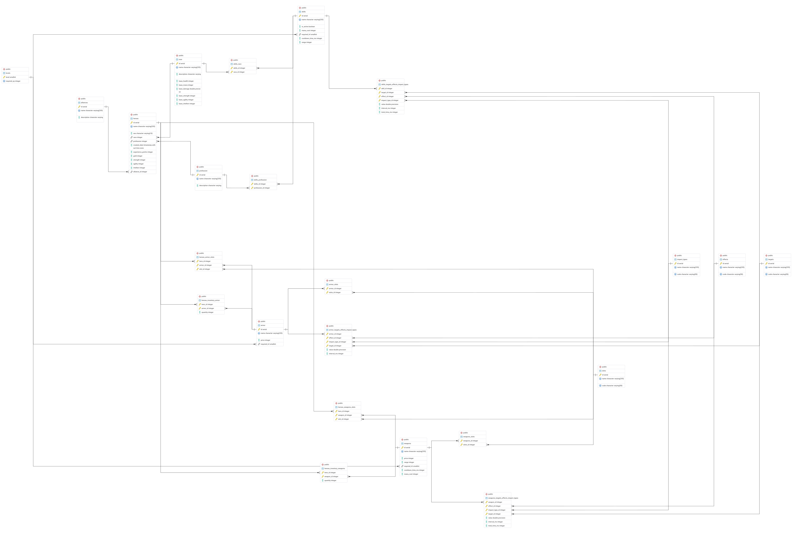

# ⚔️ Схема базы данных MMORPG (PostgreSQL)

## Общее описание

База данных моделирует основные игровые сущности MMORPG: герои, расы, профессии, навыки, оружие, броня, альянсы и экономика (золото, инвентарь).

## Схема базы данных



---

## Справочные таблицы

### `race` — 🧬 Расы

Хранит расы, доступные при создании героя. Каждая раса задаёт базовые характеристики, от которых рассчитываются итоговые параметры героя.

| Поле | Описание |
|---|---|
| `id` | Уникальный идентификатор |
| `name` | Название расы (Human, Elf, Dwarf и т.д.) |
| `description` | Текстовое описание расы |
| `base_health` | ❤️ Базовое здоровье |
| `base_mana` | 🔷 Базовая мана |
| `base_damage` | 💥 Базовый урон |
| `base_strength` | 💪 Базовая сила |
| `base_agility` | 🏃 Базовая ловкость |
| `base_intellect` | 🧠 Базовый интеллект |

### `profession` — 🎭 Профессии (классы)

Класс героя, определяющий набор доступных профессиональных навыков.

| Поле | Описание |
|---|---|
| `id` | Уникальный идентификатор |
| `name` | Название профессии (Warrior, Mage, Rogue и т.д.) |
| `description` | Текстовое описание |

### `alliances` — 🏰 Альянсы (гильдии)

Объединения игроков. Герой может состоять в одном альянсе или не состоять ни в одном.

| Поле | Описание |
|---|---|
| `id` | Уникальный идентификатор |
| `name` | Название альянса |
| `description` | Описание альянса |

### `levels` — 📈 Уровни

Таблица прогрессии: связь между номером уровня и необходимым количеством опыта. Уровень героя вычисляется как максимальный `level`, для которого `required_xp <= experience_points` героя.

| Поле | Описание |
|---|---|
| `level` | Номер уровня (PK, > 0) |
| `required_xp` | Минимальное количество опыта для достижения уровня |

### `effects` — ✨ Эффекты

Типы воздействий, которые могут наносить навыки, оружие и броня.

| Код | Описание |
|---|---|
| `damage` | 💥 Нанесение урона |
| `heal` | 💚 Восстановление здоровья |
| `vulnerability` | 🔻 Наложение уязвимости (увеличение получаемого урона) |
| `invulnerability` | 🛡️ Предоставление неуязвимости (снижение или блокировка урона) |

### `targets` — 🎯 Цели

На кого может быть направлено воздействие.

| Код | Описание |
|---|---|
| `self` | На самого себя |
| `allies` | На союзников |
| `enemy` | На одного противника |
| `area_radius` | По площади (AoE) |

### `impact_types` — Типы воздействия

Стихия или природа воздействия.

| Код | Описание |
|---|---|
| `physical` | 👊 Физический урон/защита |
| `magical` | 🔮 Магический урон/защита |
| `fire` | 🔥 Огненная стихия |
| `water` | 🌊 Водная стихия |
| `earth` | 🪨 Стихия земли |
| `air` | 🌪️ Воздушная стихия |

### `slots` — 🧍 Слоты экипировки

Части тела, в которые можно надеть предметы.

| Код | Описание |
|---|---|
| `head` | 🪖 Голова |
| `chest` | 👕 Грудь |
| `main_hand` | 🤚 Основная рука |
| `off_hand` | ✋ Вторая рука |
| `legs` | 👖 Ноги |
| `feet` | 👢 Ступни |

---

## 🗡️ Предметы

### `weapons` — Оружие

| Поле | Описание |
|---|---|
| `id` | Уникальный идентификатор |
| `name` | Название оружия |
| `price` | 🪙 Стоимость в золоте |
| `range` | 📏 Дальность атаки |
| `required_lvl` | 📈 Минимальный уровень для использования (FK → `levels`) |
| `cooldown_time_ms` | ⏱️ Перезарядка между атаками (мс) |
| `mana_cost` | 🔷 Расход маны за атаку |

### `armor` — 🛡️ Броня

| Поле | Описание |
|---|---|
| `id` | Уникальный идентификатор |
| `name` | Название брони |
| `price` | 🪙 Стоимость в золоте |
| `required_lvl` | 📈 Минимальный уровень для использования (FK → `levels`) |

---

## 🪄 Навыки

### `skills` — Навыки (заклинания)

| Поле | Описание |
|---|---|
| `id` | Уникальный идентификатор |
| `name` | Название навыка |
| `is_active` | ⚡ `true` = активный (требует применения), `false` = пассивный (действует постоянно) |
| `mana_cost` | 🔷 Расход маны |
| `required_lvl` | 📈 Минимальный уровень (FK → `levels`) |
| `cooldown_time_ms` | ⏱️ Перезарядка (мс) |
| `range` | 📏 Дальность применения |

---

## 🦸 Персонажи

### `heroes` — Герои

| Поле | Описание |
|---|---|
| `id` | Уникальный идентификатор |
| `name` | Имя героя (уникальное) |
| `sex` | Пол (`'male'` или `'female'`, CHECK) |
| `race` | 🧬 Раса (FK → `race`) |
| `profession` | 🎭 Профессия (FK → `profession`, может быть NULL) |
| `created_date` | 📅 Дата создания персонажа |
| `experience_points` | ⭐ Накопленный опыт |
| `gold` | 🪙 Количество золота |
| `strength` | 💪 Очки силы героя |
| `agility` | 🏃 Очки ловкости героя |
| `intellect` | 🧠 Очки интеллекта героя |
| `alliance_id` | 🏰 Альянс (FK → `alliances`, может быть NULL) |

---

## 🔗 Связующие таблицы

### 🪄 Навыки и их источники

Каждый навык принадлежит **либо** расе, **либо** профессии — пересечений нет.

- **`skills_race`** (`skills_id`, `race_id`) — 🧬 врождённые расовые способности. Пример: все люди умеют Heal.
- **`skills_profession`** (`skills_id`, `profession_id`) — 🎭 изученные профессиональные навыки. Пример: только маги владеют Fireball.

### 🧍 Экипировка и слоты

- **`weapons_slots`** (`weapons_id`, `slots_id`) — в какие слоты можно поместить оружие. Например, кинжал подходит и в основную, и во вторую руку.
- **`armor_slots`** (`armor_id`, `slots_id`) — в какие слоты можно надеть броню.
- **`heroes_weapons_slots`** (`hero_id`, `weapon_id`, `slot_id`) — какое оружие экипировано у героя и в каком слоте.
- **`heroes_armor_slots`** (`hero_id`, `armor_id`, `slot_id`) — какая броня экипирована у героя и в каком слоте.

### 🎒 Инвентарь

- **`heroes_inventory_weapons`** (`hero_id`, `weapon_id`, `quantity`) — купленное, но не экипированное оружие.
- **`heroes_inventory_armor`** (`hero_id`, `armor_id`, `quantity`) — купленная, но не экипированная броня.

---

## ⚙️ Механика эффектов и целей

Воздействие навыков, оружия и брони описывается через комбинацию четырёх измерений:

```
(предмет/навык) × (цель) × (эффект) × (тип воздействия) → значение
```

Это реализовано в трёх таблицах:

### `skills_targets_effects_impact_types`

Описывает, что делает навык при применении.

| Поле | Описание |
|---|---|
| `skill_id` | 🪄 Навык |
| `target_id` | 🎯 На кого направлен |
| `effect_id` | ✨ Какой эффект производит |
| `impact_type_id` | 🌀 Стихия/тип воздействия |
| `value` | 🔢 Числовое значение эффекта |
| `interval_ms` | ⏱️ Интервал повторения (для эффектов с тиками, NULL = мгновенный) |
| `total_time_ms` | ⏳ Общая длительность (NULL = мгновенный) |

**Пример:** 🔥 Fireball — `(Fireball, Enemy, Damage, Fire, 45.0, NULL, NULL)` — мгновенно наносит 45 единиц огненного урона по одному врагу.

**Пример с длительностью:** 🌪️ Thunder Strike — `(Thunder Strike, Enemy, Vulnerability, Air, 0.5, 3000, 9000)` — накладывает воздушную уязвимость на врага: каждые 3 секунды в течение 9 секунд.

### `weapons_targets_effects_impact_types`

Аналогичная таблица для оружия. Описывает базовый урон и эффекты оружия при атаке.

### `armor_targets_effects_impact_types`

Аналогичная таблица для брони. Обычно содержит защитные эффекты (`invulnerability`) на себя (`self`).

**Пример:** 🛡️ Plate Armor — `(Plate Armor, Invulnerability, Physical, Self, 20.0)` — снижает физический урон на 20 единиц.

---

## 📊 Материализованное представление `hero_stats`

Предвычисленные боевые характеристики каждого героя. Формулы:

| Характеристика | Формула |
|---|---|
| ❤️ Здоровье (health) | `base_health + total_strength × 50` |
| 💥 Урон (damage) | `base_damage + total_agility × 10` |
| 🔷 Мана (mana) | `base_mana + total_intellect × 30` |

Где `total_strength = hero.strength + race.base_strength` (аналогично для остальных).

Уровень вычисляется как `MAX(level)` из таблицы `levels`, где `required_xp <= experience_points`.

Обновление: `REFRESH MATERIALIZED VIEW CONCURRENTLY public.hero_stats;`

---

## 🪙 Экономика

- У каждого героя есть поле `gold` — количество золота.
- У каждого предмета (оружие и броня) есть поле `price` — стоимость в золоте.
- При покупке предмет попадает в инвентарь (`heroes_inventory_weapons` / `heroes_inventory_armor`).
- При экипировке предмет перемещается из инвентаря в слот (`heroes_weapons_slots` / `heroes_armor_slots`).

---

## 🚀 Возможные точки расширения

### Новые игровые сущности
- **Зелья и расходники** — отдельная таблица `consumables` с эффектами, аналогичными оружию/навыкам, и инвентарём.
- **Квесты** — таблицы `quests` и `heroes_quests` для отслеживания прогресса, наград (опыт, золото, предметы).
- **NPC и монстры** — таблица `mobs` с характеристиками, лут-таблицами и привязкой к локациям.

### Расширение экономики
- **Торговля между игроками** — таблица `trade_history` с логированием обменов.
- **Аукцион** — таблица `auction_listings` для размещения предметов на продажу.
- **Улучшение предметов (enchanting)** — таблица `enchantments`, позволяющая добавлять бонусные эффекты к конкретным экземплярам предметов.

### Боевая система
- **Таланты/дерево навыков** — таблица `talent_tree` с зависимостями между навыками и бонусами при прокачке.
- **Баффы и дебаффы** — таблица `active_effects` для отслеживания временных эффектов, наложенных на героя в реальном времени.
- **PvP-статистика** — таблица `pvp_history` для записи результатов боёв между игроками.

### Социальная система
- **Друзья** — таблица `friends` для связей между героями.
- **Чат/почта** — таблицы `messages` для внутриигровой коммуникации.
- **Ранги внутри альянсов** — добавление ролей (лидер, офицер, рядовой) в связь героя с альянсом.

### Мир и контент
- **Локации/карты** — таблица `locations` с привязкой монстров, NPC и ресурсов к зонам.
- **Достижения** — таблицы `achievements` и `heroes_achievements` для отслеживания прогресса.
- **События** — таблица `events` для временных игровых мероприятий с особыми наградами.

---

## Нормальные формы

Схема удовлетворяет требованиям **первой (1НФ)**, **второй (2НФ)** и **третьей (3НФ)** нормальных форм. Ниже — разбор каждой формы с конкретными примерами из схемы.

### 1️⃣ Первая нормальная форма (1НФ)

**Требование:** каждый атрибут содержит только атомарные (неделимые) значения; нет повторяющихся групп столбцов.

**Как реализовано:**

- Все поля содержат скалярные значения. Нет массивов, JSON-объектов или вложенных структур.
- Многозначные связи вынесены в отдельные таблицы. Например, герой может владеть несколькими навыками — вместо хранения списка навыков в одном поле таблицы `heroes`, связь описана через `skills_race` и `skills_profession`.
- Аналогично: вместо столбца "список слотов оружия" в таблице `weapons` создана связующая таблица `weapons_slots`.
- У каждой таблицы определён первичный ключ (простой или составной).

### 2️⃣ Вторая нормальная форма (2НФ)

**Требование:** таблица в 1НФ + каждый неключевой атрибут полностью функционально зависит от **всего** первичного ключа (а не от его части).

**Как реализовано:**

- В таблицах с простым ключом (`id`) 2НФ выполняется автоматически, так как ключ состоит из одного атрибута. Это таблицы: `race`, `profession`, `alliances`, `skills`, `effects`, `targets`, `impact_types`, `slots`, `weapons`, `armor`, `heroes`.
- В таблицах с составным ключом неключевые атрибуты зависят от всей комбинации:
  - `skills_targets_effects_impact_types` (PK: `skill_id, target_id, effect_id, impact_type_id`) — поля `value`, `interval_ms`, `total_time_ms` определяются именно комбинацией конкретного навыка, цели, эффекта и типа воздействия. Например, значение урона Fireball по одному врагу (45) отличается от значения по площади (25).
  - `heroes_inventory_weapons` (PK: `hero_id, weapon_id`) — поле `quantity` зависит от конкретной пары "герой + оружие", а не от героя или оружия по отдельности.
- Чисто связующие таблицы без неключевых атрибутов (`skills_race`, `weapons_slots`, `armor_slots` и т.д.) удовлетворяют 2НФ тривиально.

### 3️⃣ Третья нормальная форма (3НФ)

**Требование:** таблица в 2НФ + нет транзитивных зависимостей (неключевой атрибут не зависит от другого неключевого атрибута).

**Как реализовано:**

- Справочные данные вынесены в отдельные таблицы и связаны через FK вместо дублирования:
  - Имя расы не хранится в `heroes` — хранится только `race` (FK → `race.id`), а название получается через JOIN. То же для `profession` и `alliance_id`.
  - Уровень героя не хранится явно — он вычисляется из `experience_points` через таблицу `levels`. Это исключает аномалию, при которой опыт и уровень могли бы рассогласоваться.
  - Стоимость предмета хранится в `weapons.price` / `armor.price`, а не дублируется в инвентаре или экипировке.
- Вычисляемые характеристики (health, damage, mana) **не хранятся в таблице `heroes`** — они вынесены в материализованное представление `hero_stats`. Это устраняет транзитивную зависимость: `hero_id → strength → health`.
- Эффекты, цели и типы воздействия — отдельные справочники, а не текстовые значения, вшитые в таблицы навыков или предметов.

### 🅱️ Нормальная форма Бойса-Кодда (BCNF)

**Требование:** для каждой нетривиальной функциональной зависимости `X → Y` множество `X` является суперключом.

Схема также соответствует BCNF:

- Во всех таблицах с простым ключом (`id` или `level`) единственным детерминантом является сам ключ.
- В таблицах с составным ключом (связующие таблицы) неключевые атрибуты (если есть) функционально зависят только от полного составного ключа. Нет ситуаций, где часть составного ключа определяет неключевой атрибут (это было бы нарушением 2НФ) или где неключевой атрибут определяет часть ключа.

### 4️⃣ Четвёртая нормальная форма (4НФ)

**Требование:** таблица в BCNF + нет нетривиальных многозначных зависимостей (MVD). Если сущность имеет два и более независимых многозначных факта, они должны храниться в отдельных таблицах.

**Как реализовано:**

- Главный кандидат на нарушение 4НФ — навыки, которые одновременно привязаны к расам и профессиям. Если бы связь хранилась в одной таблице `(skill_id, race_id, profession_id)`, это была бы классическая нарушенная 4НФ: расы и профессии — независимые многозначные факты о навыке. В схеме эта связь разделена на две таблицы: `skills_race` и `skills_profession` — ровно так, как требует 4НФ.
- Таблица `heroes_weapons_slots` (`hero_id`, `weapon_id`, `slot_id`) **не нарушает** 4НФ, так как это неделимый трёхсторонний факт: конкретный герой экипировал конкретное оружие в конкретный слот. Знание пар (герой-оружие) и (герой-слот) по отдельности не позволяет восстановить тройку. Аналогично для `heroes_armor_slots`.
- Таблицы эффектов (`skills_targets_effects_impact_types` и т.д.) хранят конкретное значение для каждой комбинации (навык × цель × эффект × тип), а не независимые списки — это единый факт, а не пересечение независимых MVD.

### 5️⃣ Пятая нормальная форма (5НФ / PJNF)

**Требование:** таблица в 4НФ + нет нетривиальных зависимостей соединения. Таблицу нельзя без потерь разложить на несколько меньших таблиц и затем восстановить через JOIN.

**Как реализовано:**

- `heroes_weapons_slots` (`hero_id`, `weapon_id`, `slot_id`) — нельзя разложить на три бинарные таблицы (герой-оружие, герой-слот, оружие-слот) и получить тот же результат при соединении. Пример: Артас владеет мечом, Артас использует слот «основная рука», меч подходит в «основную руку» — но из этого не следует, что Артас экипировал меч именно в эту руку (он мог экипировать в эту руку другое оружие). Тройка неделима — 5НФ соблюдена.
- `skills_targets_effects_impact_types` — аналогично, четвёрка (навык, цель, эффект, тип) представляет единый факт с конкретным значением. Разложение на пары привело бы к появлению ложных комбинаций при соединении.
- Бинарные связующие таблицы (`skills_race`, `weapons_slots`, `armor_slots` и т.д.) тривиально удовлетворяют 5НФ, так как их нельзя разложить дальше.

### 6️⃣ Шестая нормальная форма (6НФ)

**Требование:** каждая таблица содержит не более одного неключевого атрибута помимо ключа-кандидата. По сути, каждый факт хранится в отдельной таблице.

**❌ Не реализована (и не должна быть).**

Большинство таблиц схемы содержат несколько неключевых атрибутов:
- `race` — 8 неключевых полей (name, description, base_health, base_mana и т.д.)
- `heroes` — 10 неключевых полей
- `weapons` — 5 неключевых полей

Приведение к 6НФ потребовало бы разложения, например, таблицы `race` на 8 отдельных таблиц: `race_name(id, name)`, `race_base_health(id, base_health)`, `race_base_mana(id, base_mana)` и т.д. Это:
- многократно увеличивает количество таблиц и JOIN-ов в запросах
- не даёт практических преимуществ для данной предметной области
- ухудшает читаемость и производительность

6НФ применяется на практике почти исключительно в **темпоральных базах данных**, где необходимо отслеживать историю изменения каждого атрибута независимо (например, «зарплата сотрудника менялась в такие-то даты, а должность — в другие»). Для игровой БД это избыточно.

**✅ Итого:** схема полностью нормализована до **5НФ** включительно. 6НФ не применяется сознательно, так как не соответствует требованиям предметной области.
