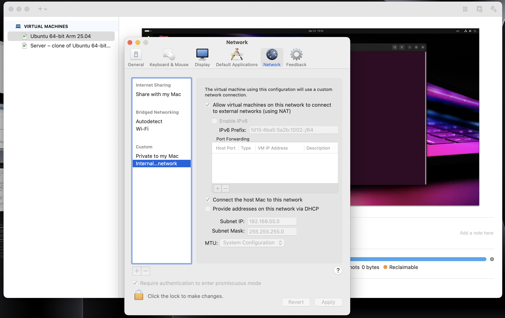
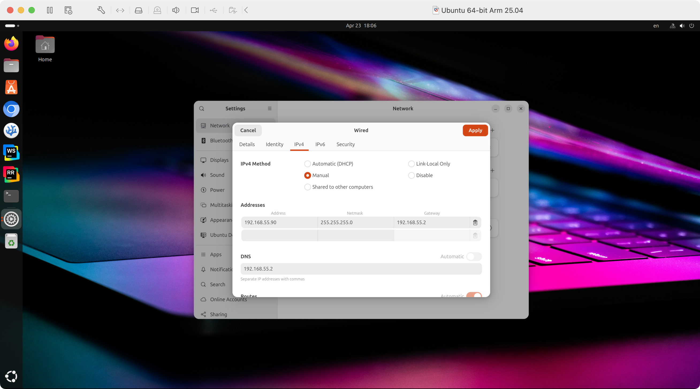
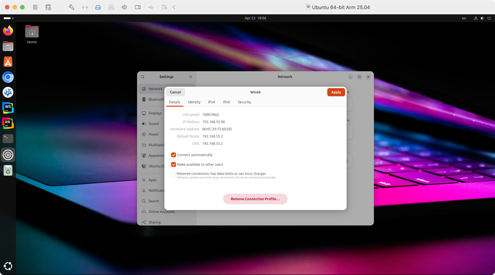
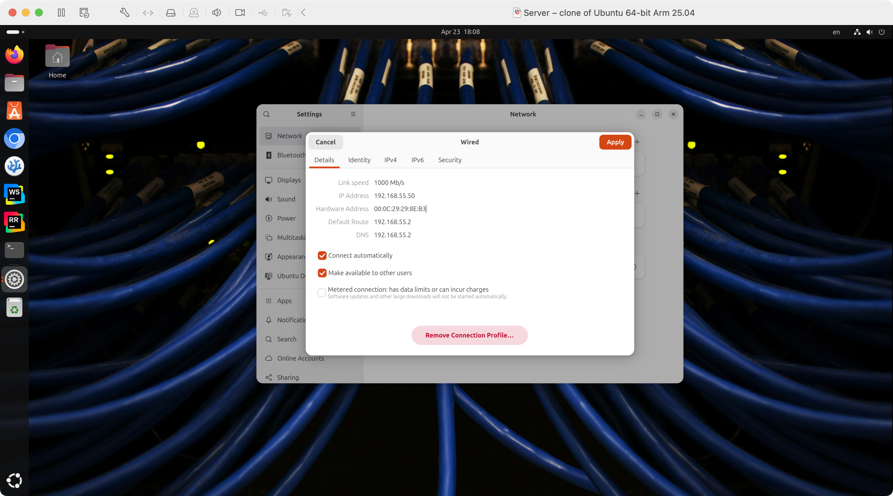
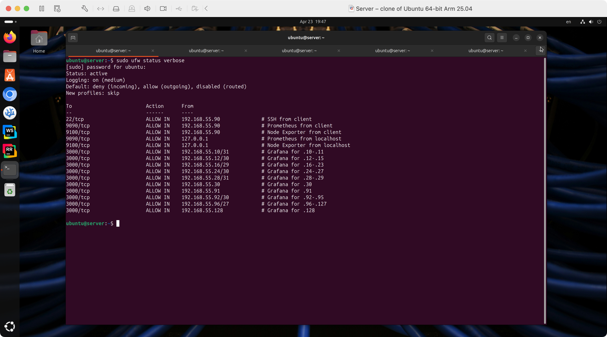
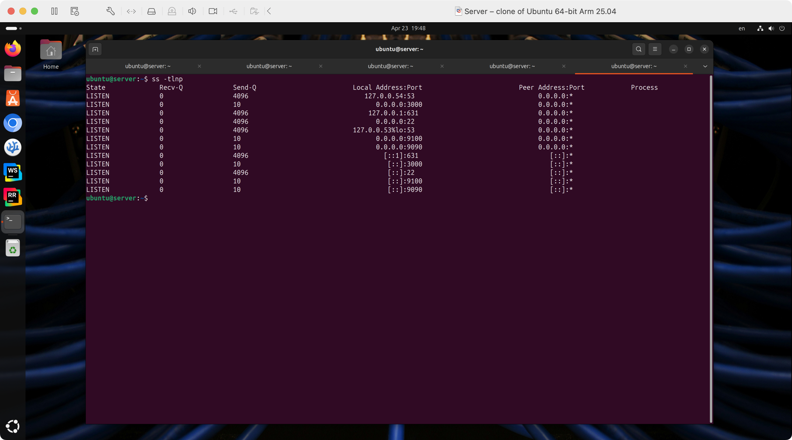
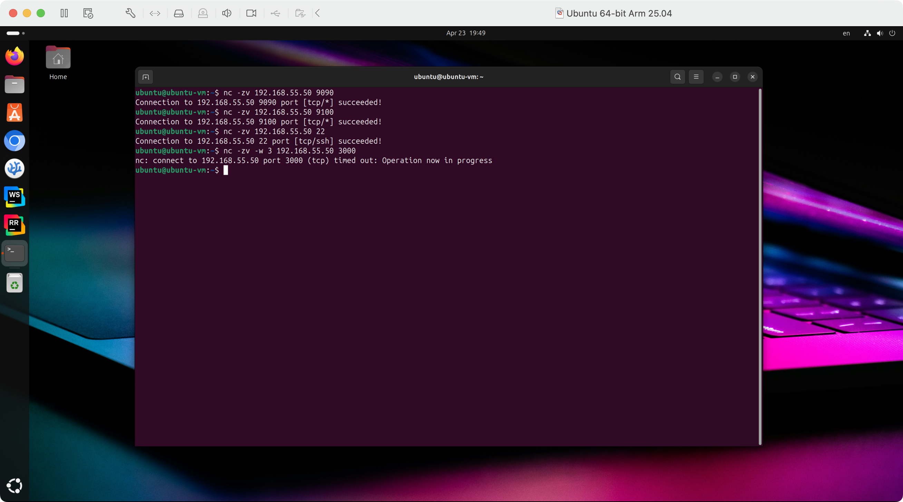
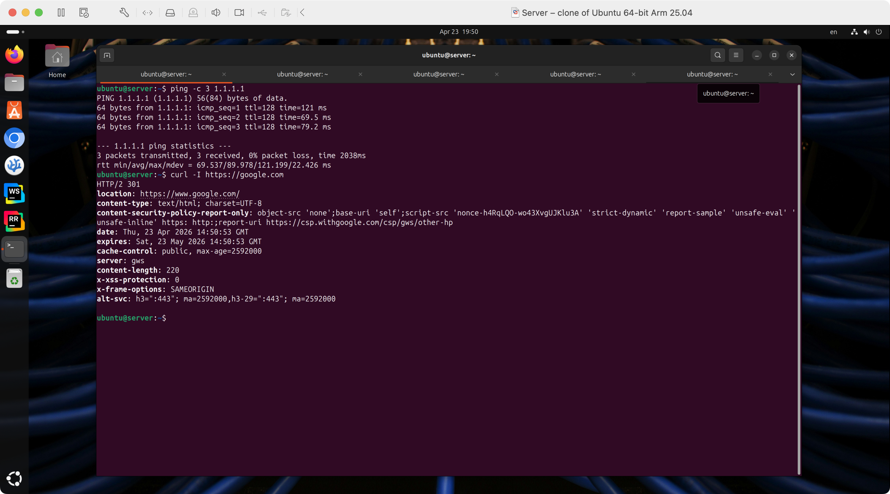

# Задание №1 – Настройка UFW

Использовались 2 виртуальные машины на Ubuntu, объединенные в единую NAT-сеть `192.168.55.0/24` _без DHCP_: ubuntu-vm (клиент) и server (собственно, сервер).



IP-адреса, маски и DNS были заданы для каждой VM вручную, в качестве Default Gateway указал `192.168.55.2` – особенность VMWare на MacOS: хост тоже добавляется в сеть с адресом `.1`








## Конфигурация сервера

1. Установка ufw:

    ```sh
    sudo apt install ufw
    ```

2. Установка SSH-сервера

    ```sh
    sudo apt install openssh-server
    sudo systemctl enable ssh
    ```

3. Настройка базовых правил для ufw:

    ```sh
    sudo ufw --force reset
    sudo ufw default deny incoming
    sudo ufw default allow outgoing  
    ```

4. Настройка правил для входящих соединений согласно заданию:

    4.1 SSH:
    
    ```sh
    sudo ufw allow from 192.168.55.90 to any port 22 proto tcp comment 'SSH from client'
    ```
    
    4.2 Prometheus и Node Exporter:
    
    ```sh
    sudo ufw allow from 192.168.55.90 to any port 9090 proto tcp comment 'Prometheus from client'
    sudo ufw allow from 192.168.55.90 to any port 9100 proto tcp comment 'Node Exporter from client'

    sudo ufw allow from 127.0.0.1 to any port 9090 proto tcp comment 'Prometheus from localhost'
    sudo ufw allow from 127.0.0.1 to any port 9100 proto tcp comment 'Node Exporter from localhost'
    ```
    
    4.3 Grafana:

    Для точного вхождения всех адресов в заданных диапазонах, были рассчитаны маски и адреса подсетей, например: в сеть `192.168.55.16/29` входят адреса с `.16` по `.23`. Уменьшив количество бит в маске даже на 1, получим вхождение адреса `.31`, что противоречит условию задания.

    ```sh
    sudo ufw allow from 192.168.55.10/31 to any port 3000 proto tcp comment 'Grafana for .10-.11'
    sudo ufw allow from 192.168.55.12/30 to any port 3000 proto tcp comment 'Grafana for .12-.15'
    sudo ufw allow from 192.168.55.16/29 to any port 3000 proto tcp comment 'Grafana for .16-.23'
    sudo ufw allow from 192.168.55.24/30 to any port 3000 proto tcp comment 'Grafana for .24-.27'
    sudo ufw allow from 192.168.55.28/31 to any port 3000 proto tcp comment 'Grafana for .28-.29'
    sudo ufw allow from 192.168.55.30/32 to any port 3000 proto tcp comment 'Grafana for .30'
    ```

    ```sh
    sudo ufw allow from 192.168.55.91/32  to any port 3000 proto tcp comment 'Grafana for .91'
    sudo ufw allow from 192.168.55.92/30  to any port 3000 proto tcp comment 'Grafana for .92-.95'
    sudo ufw allow from 192.168.55.96/27  to any port 3000 proto tcp comment 'Grafana for .96-.127'
    sudo ufw allow from 192.168.55.128/32 to any port 3000 proto tcp comment 'Grafana for .128'
    ```

5. Активация ufw

    ```sh
    sudo ufw enable
    sudo ufw status verbose
    ```

## Проверка:



Для имитации работы реальных сервисов на сервере был установлен `ncat` и запущены следующие команды:

```sh
sudo apt install -y ncat

sudo ncat -l -k -p 9090
sudo ncat -l -k -p 9100
sudo ncat -l -k -p 3000
```



На VM клиента было проверено подключение к серверу по SSH, а также к заглушкам Prometheus и Node Exporter на портах `9090` и `9100` соответственно.

```sh
ssh ubuntu@192.168.55.50
```

```sh
nc -zv 192.168.55.50 9090
nc -zv 192.168.55.50 9100
```

Соединение было успешно установлено.

Для проверки недоступности Grafana на VM клиента была использована команда:

```sh
nc -zv 192.168.55.50 3000
```

Соединение не было установлено, что соответствует настройкам ufw.



Также для проверки работы исходящих соединений на VM сервера была использована команда:

```sh
ping -c 3 1.1.1.1
curl -I https://google.com
```

